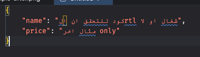
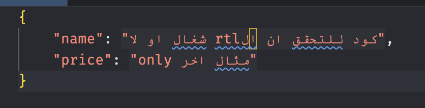

# Arabic RTL Support

> إضافة لـ Visual Studio Code تكتشف النصوص العربية في كودك تلقائيًا وتعرضها بشكل صحيح من **اليمين إلى اليسار (RTL)** — حتى تقرأ نصوصك العربية بشكل طبيعي مباشرة داخل المحرر.

---

## تبثيت

<!-- i74ifa.arabic-rtl-support -->

```bash

ext install i74ifa.arabic-rtl-support

```

## ✨ المميزات

### 🔍 كشف تلقائي للنصوص العربية

تقوم الإضافة بفحص ملفات TypeScript/JavaScript في الوقت الفعلي باستخدام محلل AST. أي نص يحتوي على حروف عربية يتم اكتشافه وتزيينه فورًا — بدون أي إعداد يدوي.

### ↔️ عرض النص من اليمين لليسار

يتم تطبيق `direction: rtl; unicode-bidi: isolate;` على النصوص العربية، مما يجعلها تُعرض من اليمين لليسار

### 🎨 تخصيص المظهر

يمكنك تمييز النصوص العربية بلون خلفية وشفافية قابلَين للضبط. كما يمكنك تغيير لون النص بشكل مستقل.

---

## 📸 معاينة

**قبل**



**بعد**



---

## ⚙️ إعدادات الإضافة

يمكنك تخصيص الإضافة عبر **إعدادات VS Code** (`Cmd+,` على macOS أو `Ctrl+,` على Windows/Linux)، ثم ابحث عن **"Arabic RTL Support"**.

| الإعداد                              | النوع     | القيمة الافتراضية | الوصف                                                           |
| ------------------------------------ | --------- | ----------------- | --------------------------------------------------------------- |
| `arabicRtlSupport.enableBackground`  | `boolean` | `true`            | تفعيل أو تعطيل الخلفية على النصوص العربية                       |
| `arabicRtlSupport.backgroundColor`   | `string`  | `#ffffff`         | لون الخلفية للنصوص العربية (hex أو rgb)                         |
| `arabicRtlSupport.backgroundOpacity` | `number`  | `0.05`            | شفافية الخلفية من `0` (شفاف) إلى `1` (معتم)                     |
| `arabicRtlSupport.textColor`         | `string`  | `""`              | لون مخصص للنص العربي. اتركه فارغًا لاستخدام لون الثيم الافتراضي |

### مثال على `settings.json`

```json
{
  "arabicRtlSupport.enableBackground": true,
  "arabicRtlSupport.backgroundColor": "#1e90ff",
  "arabicRtlSupport.backgroundOpacity": 0.1,
  "arabicRtlSupport.textColor": ""
}
```

---

## 🚀 كيف تعمل الإضافة؟

1. **عند الفتح** — تقوم الإضافة بتزيين النصوص العربية في المحرر النشط فورًا.
2. **عند تبديل التبويب** — الانتقال لملف جديد يُشغّل الكشف تلقائيًا.
3. **أثناء الكتابة** — عند كتابة أو تعديل الكود، يتم الكشف عن النصوص العربية وتمييزها لحظيًا.
4. **عند تغيير الإعدادات** — أي تغيير في إعدادات `arabicRtlSupport.*` يُطبَّق فورًا بدون إعادة تشغيل.

تعتمد الإضافة على **TypeScript Compiler API** لتحليل الملفات كـ AST واستخراج النصوص الحرفية فقط — مما يضمن عدم التأثير على التعليقات أو أسماء المتغيرات أو الكلمات المحجوزة.

---

## 📦 المتطلبات

- **VS Code** `^1.0.0`
- لا توجد متطلبات إضافية — الإضافة تعمل مباشرة بعد التثبيت.

---

## 🐛 المشاكل المعروفة

- الملفات الكبيرة جدًا ذات النصوص العربية الكثيرة قد تشهد تأخيرًا طفيفًا في التزيين.

---

## 📋 سجل الإصدارات

### 0.0.1

- الإصدار الأول
- كشف تلقائي للنصوص العربية باستخدام TypeScript AST
- عرض RTL مع `unicode-bidi: isolate`
- تخصيص لون الخلفية والشفافية ولون النص
- تحديث فوري عند الكتابة وعند تغيير الإعدادات

---

## 🤝 المساهمة

نرحب بطلبات السحب والمشاكل المبلغ عنها! لا تتردد في فتح نقاش إذا كان لديك أفكار لدعم أنواع ملفات أخرى أو ميزات عربية إضافية.

---

**استمتع بكتابة الكود العربي بالطريقة الصحيحة!**
